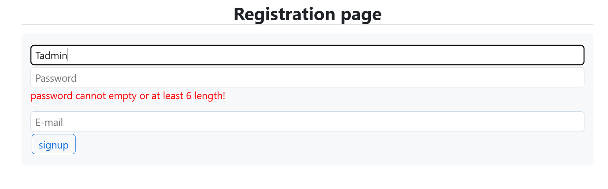
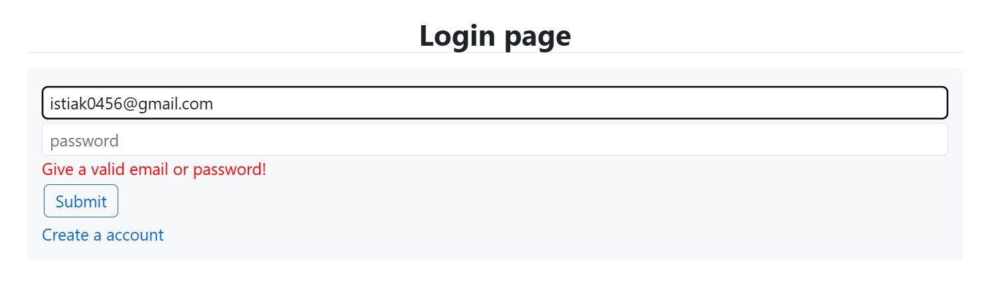
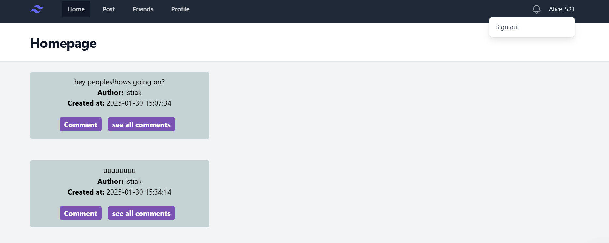
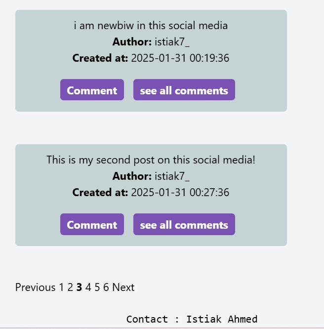
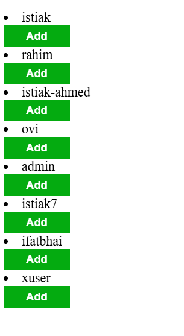

# 
Social Media App

## Features
* ### Authentication.(Register,Login,Logout)
* ### Create post & Manage post.(Write,View)
* ### Create comment on post 
* ### Sent & Manage Friend Requests.(Accept/Decline)
* ### Show dynamic data of each user in profile
* ### Pagination for Better Performance
* ### Optimized OOP Structure 

## Technology
* ### PHP (Object-Oriented Programming)
* ### MySQL (Database)
* ### HTML, CSS 

The project is designed using reusable OOP principles for better maintainability.I use sperate class for User,Comment,Database.I try to efficient SQL queries for better performance and well folder structure.

_Here some Overview of this project-_

